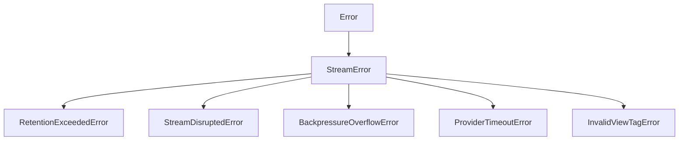

The `fetchAnnouncementsStream` function establishes a reactive real-time stream for monitoring stealth address announcements emitted across supported networks. It provides fine-grained control over retention bounds, view-tag pre-filtering, caching, backpressure mitigation, and stream cancellation.

## Import & Function Signature

```typescript
import { fetchAnnouncementsStream, Chain } from "@wraith-protocol/sdk";
import type {
  AnnouncementsStreamOptions,
  AnnouncementStream,
  Announcement,
} from "@wraith-protocol/sdk";
```

### Signature

```typescript
function fetchAnnouncementsStream(
  chain: Chain | string,
  options?: AnnouncementsStreamOptions
): AnnouncementStream;
```

### Return Value (`AnnouncementStream`)

`fetchAnnouncementsStream` returns an `AnnouncementStream` object. It implements `AsyncIterable<Announcement>` and provides imperative lifecycle controls:

| Method / Property | Type | Description |
|---|---|---|
| `[Symbol.asyncIterator]()` | `() => AsyncIterator<Announcement>` | Allows direct iteration via `for await (... of stream)`. |
| `cancel()` | `() => Promise<void>` | Gracefully stops the stream, unsubscribes RPC listeners, and frees resources. |
| `pause()` | `() => void` | Temporarily halts event consumption from the network provider. |
| `resume()` | `() => void` | Resumes event consumption from the network provider. |
| `stats` | `StreamStats` | Read-only metrics (processed count, dropped count, queue depth, current block/ledger). |

---

## Options Reference

The `AnnouncementsStreamOptions` object configures stream behavior, filtering, retention policies, and queue management.

```typescript
interface AnnouncementsStreamOptions {
  fromBlock?: bigint | number | "latest" | "earliest";
  retention?: RetentionConfig | number;
  viewTag?: number | number[] | ViewTagFilter;
  cache?: StreamCacheOptions | FederationCache | boolean;
  backpressure?: BackpressureOptions;
  batchSize?: number;
  pollingIntervalMs?: number;
  signal?: AbortSignal;
  onError?: (error: StreamError) => void;
}
```

### Options Summary

| Option | Type | Default | Description |
|---|---|---|---|
| `fromBlock` | `bigint \| number \| "latest" \| "earliest"` | `"latest"` | Starting block number (EVM/CKB) or ledger sequence (Stellar) or slot (Solana). |
| `retention` | `RetentionConfig \| number` | `{ maxAgeMs: 86400000, fallbackPolicy: "error" }` | Maximum historical age to scan and failure policy if retention window is exceeded. |
| `viewTag` | `number \| number[] \| ViewTagFilter` | `undefined` | View-tag filter to discard non-matching announcements before crypto scanning. |
| `cache` | `StreamCacheOptions \| FederationCache \| boolean` | `{ enabled: true, ttlMs: 300000 }` | Announcement deduplication and block result cache settings. |
| `backpressure` | `BackpressureOptions` | `{ highWaterMark: 1000, lowWaterMark: 100, strategy: "pause" }` | Flow control configuration for slow stream consumers. |
| `batchSize` | `number` | `100` | Number of logs or events requested per RPC batch call. |
| `pollingIntervalMs` | `number` | `2000` | Polling frequency in milliseconds when fallback polling is active. |
| `signal` | `AbortSignal` | `undefined` | `AbortSignal` instance to trigger external cancellation. |
| `onError` | `(error: StreamError) => void` | `undefined` | Optional error handler callback for non-fatal or async stream errors. |

---

## Deep-Dive into Stream Options

### `fromBlock` / `fromLedger`

Specifies the starting point for historical retrieval before transitioning to real-time streaming.

- `"latest"`: Start streaming from the current head block/ledger.
- `"earliest"`: Attempt to stream from block 0 or genesis ledger (subject to retention limits).
- `bigint | number`: Precise block number or ledger sequence.

```typescript
// Resume streaming from a known checkpoint block
const stream = fetchAnnouncementsStream(Chain.Ethereum, {
  fromBlock: 19284000n,
});
```

### `retention`

Configures historical retention limits and recovery strategies when requested historical blocks are no longer available on the target node.

```typescript
interface RetentionConfig {
  maxAgeMs?: number;             // Default: 86400000 (24 hours in milliseconds)
  fallbackPolicy?: "error" | "horizon" | "archive_node" | "latest_checkpoint";
  allowGap?: boolean;            // Default: false
  archiveRpcUrl?: string;        // URL for archive node fallback
}
```

#### Retention Options

- **`maxAgeMs`**: Maximum permissible gap between the requested `fromBlock` timestamp and current wall-clock time. Defaults to 24 hours (86,400,000 ms).
- **`fallbackPolicy`**: Strategy invoked when `fromBlock` exceeds node retention limits:
  - `"error"` *(default)*: Immediately throw `RetentionExceededError`.
  - `"horizon"`: Fall back to Horizon indexer historical API (Stellar only).
  - `"archive_node"`: Divert queries to `archiveRpcUrl` for pruned blocks.
  - `"latest_checkpoint"`: Skip pruned history and resume from the earliest available block in the current retention window.
- **`allowGap`**: When set to `true`, acknowledges data loss and continues streaming from the earliest retained block instead of raising an error.

```typescript
import { fetchAnnouncementsStream, Chain } from "@wraith-protocol/sdk";

// Failover to archive node if retention window (>24h) is exceeded
const stream = fetchAnnouncementsStream(Chain.Stellar, {
  fromBlock: 50120000,
  retention: {
    maxAgeMs: 86400000, // 24 hours
    fallbackPolicy: "archive_node",
    archiveRpcUrl: "https://archive.mainnet.stellar.org",
  },
});
```

<Warning>
Soroban RPC nodes on Stellar retain event history for approximately 24 hours (17,280 ledgers). Requesting ledgers older than this limit without an archive fallback or `allowGap: true` will cause `RetentionExceededError` to be thrown.
</Warning>

### `viewTag`

Pre-filters incoming announcements using 1-byte view tags before performing expensive Diffie-Hellman EC scalar operations.

```typescript
interface ViewTagFilter {
  tag?: number | number[];       // Single tag (0-255) or array of tags
  matchMode?: "exact" | "range" | "mask"; // Default: "exact"
  range?: [number, number];      // [min, max] inclusive bounds (0-255)
  mask?: number;                 // Bitwise mask for tag comparison
}
```

#### View-Tag Filter Modes

- **Single Tag**: Matches exact 1-byte view tag integer (`0` to `255`).
- **Array of Tags**: Matches any view tag in the provided list.
- **Range Filter**: Matches view tags falling within `[min, max]`.
- **Bitwise Mask**: Performs `(announcement.viewTag & mask) === tag` matching.

```typescript
// Filter stream for announcements matching specific view tags
const stream = fetchAnnouncementsStream(Chain.Base, {
  viewTag: {
    tag: [0x0a, 0x42, 0xff],
    matchMode: "exact",
  },
});
```

<Note>
View tag filtering eliminates up to 99.6% of non-matching announcements on the client before cryptographic scanning (`scanAnnouncements`), significantly reducing CPU overhead.
</Note>

### `cache`

Deduplicates announcements across RPC reconnects and caches fetched block headers.

```typescript
interface StreamCacheOptions {
  enabled?: boolean;             // Default: true
  ttlMs?: number;                // Default: 300000 (5 minutes)
  maxEntries?: number;           // Default: 10000 entries
  provider?: CustomCacheProvider;// Pluggable cache implementation
}
```

```typescript
// Custom in-memory cache configuration with 10-minute TTL
const stream = fetchAnnouncementsStream(Chain.Polygon, {
  cache: {
    enabled: true,
    ttlMs: 600000,
    maxEntries: 50000,
  },
});
```

### `backpressure`

Manages memory consumption and queue buildup when downstream announcement processing is slower than network ingestion rates.

```typescript
interface BackpressureOptions {
  highWaterMark?: number;        // Default: 1000 announcements
  lowWaterMark?: number;         // Default: 100 announcements
  strategy?: "pause" | "drop_oldest" | "error"; // Default: "pause"
}
```

#### Backpressure Strategies

- `"pause"` *(default)*: Automatically pauses underlying RPC polling/subscription reads when internal queue reaches `highWaterMark`. Resumes reading once queue falls below `lowWaterMark`.
- `"drop_oldest"`: Discards the oldest unconsumed announcements in queue when `highWaterMark` is breached. Emits warning to `onError`.
- `"error"`: Immediately terminates stream and throws `BackpressureOverflowError` when queue overflows.

```typescript
// Tuned backpressure for heavy background worker tasks
const stream = fetchAnnouncementsStream(Chain.Ethereum, {
  backpressure: {
    highWaterMark: 5000,
    lowWaterMark: 500,
    strategy: "pause",
  },
});
```

### `batchSize` & `pollingIntervalMs`

Fine-tunes fetch batching and polling fallback behavior when WebSocket push subscriptions are unavailable.

```typescript
const stream = fetchAnnouncementsStream(Chain.Solana, {
  batchSize: 250,              // Request up to 250 transaction logs per RPC call
  pollingIntervalMs: 1000,     // Poll RPC every 1000ms if WebSocket disconnects
});
```

---

## Error Taxonomy

All errors emitted or thrown by `fetchAnnouncementsStream` inherit from the base `StreamError` class exported by `@wraith-protocol/sdk`.



### Error Types Reference

#### `StreamError`

Base error class for all streaming errors.

```typescript
class StreamError extends Error {
  code: string;
  chain: string;
  cause?: unknown;
}
```

#### `RetentionExceededError`

Thrown when `fromBlock` or `fromLedger` falls outside the RPC node's retained history.

```typescript
class RetentionExceededError extends StreamError {
  code: "RETENTION_EXCEEDED";
  requestedBlock: bigint | number;
  earliestAvailableBlock: bigint | number;
  retentionWindowMs: number;
}
```

**Common Causes**:
- Scanner offline for >24 hours querying Soroban RPC nodes.
- Querying non-archive EVM nodes for pruned historical logs.

**Resolution**: Pass `retention: { fallbackPolicy: "archive_node", archiveRpcUrl: "..." }` or set `allowGap: true`.

#### `StreamDisruptedError`

Raised when WebSocket connections drop or network transports fail repeatedly.

```typescript
class StreamDisruptedError extends StreamError {
  code: "STREAM_DISRUPTED";
  attemptCount: number;
  lastProcessedBlock: bigint | number;
}
```

#### `BackpressureOverflowError`

Thrown when internal queue exceeds `highWaterMark` and strategy is set to `"error"`.

```typescript
class BackpressureOverflowError extends StreamError {
  code: "BACKPRESSURE_OVERFLOW";
  queueSize: number;
  highWaterMark: number;
}
```

#### `ProviderTimeoutError`

Thrown when an underlying RPC endpoint fails to respond within the request timeout.

```typescript
class ProviderTimeoutError extends StreamError {
  code: "PROVIDER_TIMEOUT";
  endpoint: string;
  timeoutMs: number;
}
```

#### `InvalidViewTagError`

Thrown when an invalid view tag value (less than 0 or greater than 255) or malformed range filter is passed.

```typescript
class InvalidViewTagError extends StreamError {
  code: "INVALID_VIEW_TAG";
  invalidValue: unknown;
}
```

---

## Cancellation Semantics

Streams created with `fetchAnnouncementsStream` can be cancelled using either an `AbortController` signal or the imperative `stream.cancel()` method.

### 1. External Cancellation via `AbortSignal`

Pass an `AbortSignal` to options. Aborting the signal instantly stops streaming and cleans up all active network handles.

```typescript
const controller = new AbortController();

const stream = fetchAnnouncementsStream(Chain.Horizen, {
  signal: controller.signal,
});

// Cancel stream after 30 seconds
setTimeout(() => {
  controller.abort();
}, 30000);

try {
  for await (const announcement of stream) {
    console.log("Received announcement:", announcement.stealthAddress);
  }
} catch (err) {
  if (controller.signal.aborted) {
    console.log("Stream cancelled successfully.");
  }
}
```

### 2. Imperative `stream.cancel()` Method

Call `stream.cancel()` directly on the returned stream instance.

```typescript
const stream = fetchAnnouncementsStream(Chain.Stellar);

// Cancel during async loop
for await (const announcement of stream) {
  if (shouldStopProcessing(announcement)) {
    await stream.cancel();
    break;
  }
}
```

### Internal Cleanup Guarantee

When a stream is cancelled:
1. Active WebSocket push subscriptions are unsubscribed immediately.
2. Active polling timers (`setInterval`) are cleared.
3. Pending HTTP requests are cancelled via internal `AbortController`.
4. Buffered announcements in the backpressure queue are flushed and released for garbage collection.

---

## Backpressure & Flow Control

When consuming high-throughput streams (e.g. Ethereum mainnet or Solana during high traffic volume), cryptographic key derivation (`scanAnnouncements`) can slow down the consumer relative to network delivery.

### Queue Threshold Dynamics

```
      High-Water Mark (Default: 1000) ---> [ PAUSE RPC INGESTION ]
                                          |
                                          | Consumer processes queued items
                                          v
      Low-Water Mark (Default: 100)  ---> [ RESUME RPC INGESTION ]
```

### Recommended Strategy Settings

| Use Case | High Water Mark | Strategy | Rationale |
|---|---|---|---|
| Real-time UI dashboard | `100` | `"drop_oldest"` | UI only cares about fresh announcements; dropping stale updates avoids lag. |
| Cryptographic Scanner | `2000` | `"pause"` | Zero-loss tolerance. Pauses RPC reads to let scanner catch up. |
| Auditing / Indexing | `10000` | `"pause"` | Large queue buffer optimized for throughput with archival backing. |

---

## Code Examples

### Filtered Real-Time Streaming

```typescript
import { fetchAnnouncementsStream, Chain } from "@wraith-protocol/sdk";

const stream = fetchAnnouncementsStream(Chain.Ethereum, {
  fromBlock: "latest",
  viewTag: 0x42, // Pre-filter view tag 0x42
  backpressure: {
    highWaterMark: 500,
    strategy: "pause",
  },
});

console.log("Listening for filtered announcements...");

for await (const announcement of stream) {
  console.log("Matched announcement:");
  console.log("  Stealth Address:", announcement.stealthAddress);
  console.log("  Ephemeral Key:  ", announcement.ephemeralPubKey);
  console.log("  View Tag:       ", announcement.metadata.slice(0, 4));
}
```

### Resilient Stream with Retention Fallback

```typescript
import {
  fetchAnnouncementsStream,
  Chain,
  RetentionExceededError,
  StreamDisruptedError,
} from "@wraith-protocol/sdk";

const controller = new AbortController();

const stream = fetchAnnouncementsStream(Chain.Stellar, {
  fromBlock: 48000000,
  retention: {
    maxAgeMs: 86400000, // 24 hours
    fallbackPolicy: "archive_node",
    archiveRpcUrl: "https://archive-rpc.stellar.org",
    allowGap: false,
  },
  signal: controller.signal,
  onError: (err) => {
    if (err instanceof StreamDisruptedError) {
      console.warn(`Stream disrupted. Attempt ${err.attemptCount}. Resuming from ledger ${err.lastProcessedBlock}`);
    }
  },
});

try {
  for await (const announcement of stream) {
    processAnnouncement(announcement);
  }
} catch (err) {
  if (err instanceof RetentionExceededError) {
    console.error(`Retention limit exceeded! Requested ledger ${err.requestedBlock}, but earliest available is ${err.earliestAvailableBlock}`);
  } else {
    console.error("Stream failed:", err);
  }
}
```
