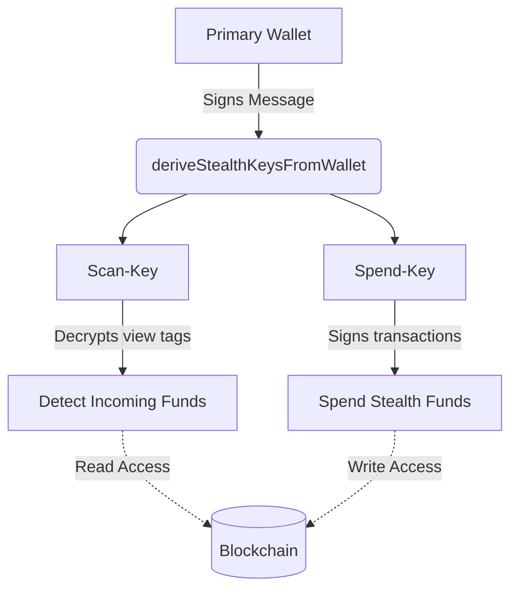

## Overview

Generating stealth keys is the foundational step for enabling private transactions. The SDK provides `deriveStealthKeysFromWallet` and related functions to generate these keys securely. 

A common stumbling block when implementing stealth architectures is confusing the two distinct keys generated by this process: the **scan-key** and the **spend-key**. Mixing these up in your application logic leads to subtle but critical bugs, such as failed transactions or an inability to parse incoming payments.

---

## Scan-Key vs. Spend-Key

Stealth protocols use a dual-key architecture to separate the ability to view transactions from the ability to spend funds. 

| Key Type | Primary Function | Permission Level | Safe to Share? |
| :--- | :--- | :--- | :--- |
| **Scan-Key** | Parses on-chain data (view tags) to identify incoming stealth payments belonging to the user. | Read-only | Yes, with trusted indexers or server-side scanners. |
| **Spend-Key** | Signs transactions to move, withdraw, or spend the funds held in a stealth address. | Write/Spend | **No.** Never share this key. |

### Architecture Flow



## Deterministic Properties
Stealth keys are generated deterministically. This means that providing the same primary wallet seed (or signing the exact same derivation message) will always produce the identical scan and spend keys.

Because of this property, users do not need to back up their stealth keys separately. As long as they maintain access to their primary wallet, they can recover their stealth funds at any time. The underlying cryptography hashes the deterministic signature to split it safely into the two respective keys.

## Deriving Keys via Message Signing
To derive stealth keys without directly exposing the user's primary private key to your application, the SDK prompts the user to sign a constant, deterministic message.
```typeScript
import { deriveStealthKeysFromWallet } from '@spectre/sdk';
import { useWalletClient } from 'wagmi';

// 1. Get the connected primary wallet client
const { data: walletClient } = useWalletClient();

// 2. Derive stealth keys by signing a deterministic message
const keys = await deriveStealthKeysFromWallet({
  client: walletClient,
  message: "Sign this message to access your stealth account." 
});

// 3. Destructure and utilize the distinct keys properly
const { scanKey, spendKey } = keys;
```

## Signing Messages with the Spend-Key
Once derived, the `spendKey` is used to sign arbitrary messages or authorize transactions originating from the stealth address. Do not use the `scanKey` for any signing operations.
```typeScript
import { signMessageWithSpendKey } from '@spectre/sdk';

const messageToSign = "Authorize stealth withdrawal";

// Correct: Using the spend-key to authorize an action
const signature = await signMessageWithSpendKey({
  spendKey: keys.spendKey,
  message: messageToSign
});

console.log("Authorized Stealth Signature:", signature);
```

## Passkey Signer Variant
If your application utilizes passkeys instead of traditional browser wallets, use the passkey-specific derivation method. This ensures the keys are properly derived from the WebAuthn signature rather than an ECDSA wallet signature.
```typeScript
import { deriveStealthKeysFromPasskey } from '@spectre/sdk';

// Derive keys using WebAuthn credential data
const keys = await deriveStealthKeysFromPasskey({
  credentialId: "user-credential-id",
  authenticatorData: authData,
  clientDataJSON: clientData
});
```

For a complete walkthrough on setting up passkey authentication with stealth transactions, refer to our [Passkey Signing Guide](../guides/stellar/passkey-signing.mdx).