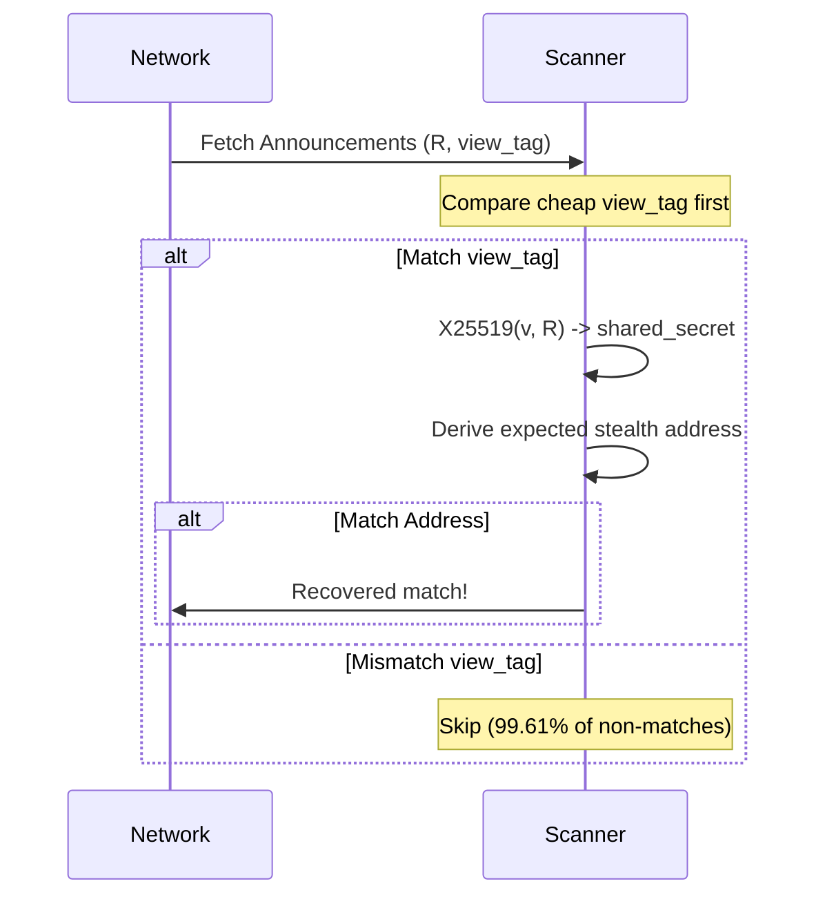

Wraith Protocol implements a non-interactive stealth payment scheme on Stellar. This page documents the cryptography decisions behind the implementation and exactly where each concept is realized in the SDK.

## Why ed25519?

Unlike EVM environments, which rely on `secp256k1`, the Stellar network uses the **ed25519** curve for all account addressing and signatures. 
To ensure that stealth accounts are valid Stellar accounts that can sign transactions, the protocol's stealth derivations must perform point addition on the ed25519 curve.

- **Curve definition**: `scalar.ts:1` (via [@noble/curves/ed25519](https://github.com/paulmillr/noble-curves))

## X25519 ECDH and Edwards-to-Montgomery Conversion

Standard ed25519 points (in Edwards form) are optimized for signing, not for Diffie-Hellman key exchange. To securely establish a shared secret between sender and receiver without interaction, we must use **X25519** ECDH.
This requires converting the public and private ed25519 keys from Edwards coordinates to Montgomery coordinates, as specified in [RFC 7748](https://datatracker.ietf.org/doc/html/rfc7748).

- **Edwards-to-Montgomery conversion**: `stealth.ts:91-92`
- **X25519 shared secret**: `stealth.ts:20` and `stealth.ts:93`

## Domain Separation Prefixes

We use domain-separation prefixes in SHA-256 hashes to prevent cryptographic collisions between different key derivation phases.

- `wraith:spending:`: Separates the derivation of the spending seed (`keys.ts:25`).
- `wraith:viewing:`: Separates the derivation of the viewing seed (`keys.ts:26`).
- `wraith:scalar:`: Prevents the hash scalar from colliding with the base shared secret before it's reduced modulo L (`scalar.ts:202`, `scalar.ts:220`).
- `wraith:stellar:view-tag:v2:`: Domains the derivation for the 1-byte view tag (`stealth.ts:8`).
- `wraith:tag:`: The legacy v1 view tag prefix (`stealth.ts:9`).

## View Tag Derivation

To avoid performing an expensive X25519 ECDH operation for every incoming transaction, the sender derives a 1-byte **view tag** and publishes it alongside their ephemeral public key.

**Derivation:**
```
view_tag = SHA-256("wraith:stellar:view-tag:v2:" || R_ephemeral || V_recipient)[0]
```

- **Implementation**: `stealth.ts:99`
- **Performance impact**: This creates a cheap public prefilter before the X25519 shared secret computation (`scan.ts:12`).
- **False-positive rate**: A 1-byte tag produces a false-positive rate of `1/256` (~0.39%). For non-matching announcements, the protocol skips the expensive elliptic curve operations 99.61% of the time.


For a deep-dive on the scan algorithm, complexity analysis, false-positive rate, and benchmark methodology, see [View-Tag Scanner Architecture](/architecture/view-tag-scanner).



## Private Scalar vs. Seeds and RFC 8032

Standard ed25519 signing libraries expect a 32-byte seed as the private key, which they hash (via SHA-512) to produce both the private scalar and a deterministic nonce.

In our non-interactive stealth scheme, the stealth private key is a *derived scalar*, not a raw seed:
```
stealth_scalar = (spending_scalar + hash_scalar) mod L
```

Because we only hold the resulting scalar, we cannot use off-the-shelf seed-based signing APIs. Instead, the SDK exposes a custom `signWithScalar` function to deterministically sign transactions using a raw scalar directly, while maintaining strict [RFC 8032](https://datatracker.ietf.org/doc/html/rfc8032) compatibility for ed25519 signatures.

- **`signWithScalar` implementation**: `scalar.ts:251`

## Meta-Address Encoding

To accept stealth payments, users publish a single "meta-address" that encapsulates both their spending and viewing public keys.

- **Prefix**: `st:xlm:` (`constants.ts:43`).
- **Encoding**: Consists of the prefix concatenated with the hex-encoded 32-byte spending public key and the 32-byte viewing public key (`meta-address.ts:10`).
- **Stellar StrKey compatibility**: To turn the final derived public stealth key into a standard Stellar address format (`G...`), we utilize Stellar's `StrKey` encoding logic (`scalar.ts:171`).

## Key Derivation Overview


### Stealth Payment Flow


### Gas-Sponsored Withdrawals

Stealth accounts often lack XLM for transaction fees. A sponsor wraps the withdrawal transaction with a fee bump.


