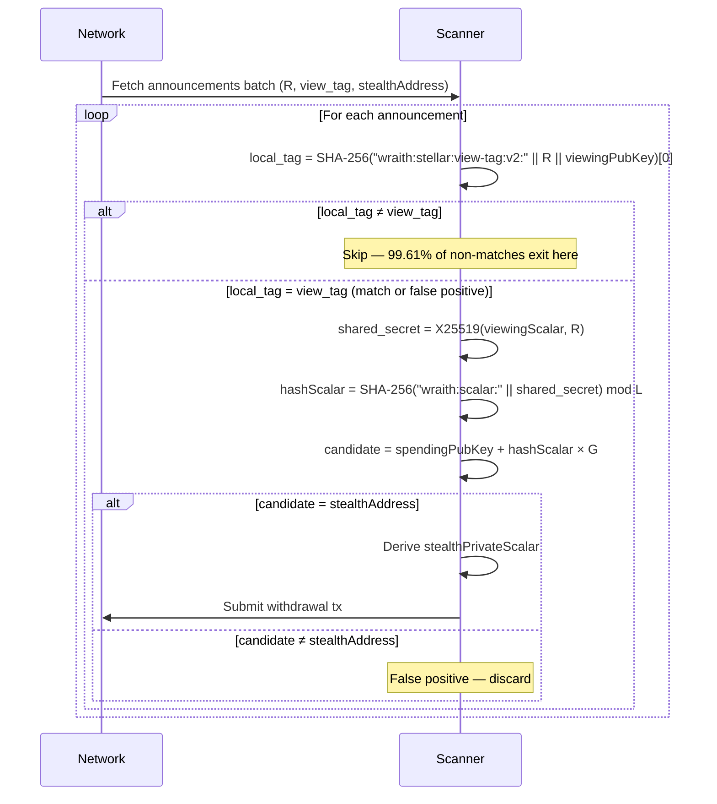

Scanning for stealth payments means checking every on-chain announcement to see if it belongs to you. Without help, each check requires a full X25519 Diffie-Hellman operation — expensive enough to become the dominant cost as the announcement set grows. The view tag is a 1-byte shortcut published alongside each announcement that lets the scanner reject ~255/256 non-matching announcements with a single byte comparison, before touching any elliptic curve arithmetic.

## The Problem: Naive Scanning Costs O(N) ECDH

A stealth payment announcement contains two public pieces of data:

- `R` — the sender's ephemeral public key (32 bytes)
- `view_tag` — a 1-byte hint derived from the shared secret (see below)

Without view tags, the recipient must perform a full scan for every announcement:

```
for each announcement (R):
  shared_secret = X25519(viewing_scalar, R)         // expensive: ~0.1–0.3 ms per op
  hash_scalar   = SHA-256("wraith:scalar:" || S)
  candidate     = spendingPubKey + hash_scalar × G  // ed25519 point addition
  if candidate == announcement.stealthAddress:
      → match (derive private key, sweep funds)
```

Every announcement demands one X25519 shared secret computation and one ed25519 point addition. Both are constant-time elliptic curve operations — fast individually, but they add up when the announcement log has thousands of entries.

## The Solution: View Tag Prefilter

The view tag is a 1-byte value derived from the same shared secret that produced the stealth address. The sender computes it and includes it in the announcement metadata. The recipient computes the same value from their side and checks it before doing any curve math.

### Derivation

**Stellar (v2, domain-separated SHA-256):**
```
view_tag = SHA-256("wraith:stellar:view-tag:v2:" || R_ephemeral || V_recipient)[0]
```

- `R_ephemeral` — the sender's ephemeral ed25519 public key (32 bytes)
- `V_recipient` — the recipient's viewing public key (32 bytes)
- Takes the first byte of the hash output — values 0–255

Source: `stealth.ts:8` (v2 prefix), `stealth.ts:9` (legacy v1 prefix `"wraith:tag:"`), `stealth.ts:99` (derivation)

**EVM (keccak256 of shared secret):**
```
view_tag = keccak256(sharedSecret)[0]
```

Both chains use the same concept: take the first byte of a hash that depends on the shared secret.

### Why This Works

The view tag is a 1-byte commitment to the shared secret. If the scanner's locally computed view tag doesn't match the announced one, the shared secret must differ — meaning the announcement belongs to someone else. The scanner can skip it with certainty.

If the tags match, it doesn't prove ownership (false positives exist at rate 1/256), but it narrows the set to `~N/256` candidates that each warrant the full X25519 computation.

```
for each announcement (R, view_tag):
  local_tag = view_tag_from_viewing_key(R, viewingPubKey)  // cheap: one SHA-256
  if local_tag != view_tag:
      → skip (no curve math)                               // 99.61% of non-matches
  // only reach here for ~1/256 of all announcements
  shared_secret = X25519(viewing_scalar, R)
  ...full check...
```

Source: `scan.ts:12` (prefilter application)

## Scan Comparison


The cost structure:

| Mode | Per announcement | Total for N |
|---|---|---|
| Without view tags | 1 × X25519 + 1 × point add | N × (X25519 + point add) |
| With view tags | 1 × SHA-256 byte compare | N × SHA-256 + ~N/256 × X25519 |

For a concrete example:

```
N = 1,000 announcements, recipient has no matches:

Without view tags:
  1,000 × X25519 computations

With view tags:
  1,000 × byte comparisons
  + ~3.9 × X25519 (false positives only — ~1/256 pass the tag check)
```

SHA-256 is roughly two orders of magnitude faster than X25519 on a modern CPU. The view tag turns ECDH work into hashing work for 255 out of every 256 announcements.

## False-Positive Rate

A 1-byte tag has 256 possible values. For any given announcement that does **not** belong to you, the probability that your locally computed tag happens to match is exactly `1/256 ≈ 0.39%`.

This is the false-positive rate — not a false-negative. The view tag never causes you to miss a payment that is yours. It only produces occasional extra X25519 checks for announcements that aren't yours.

| Property | Value |
|---|---|
| Tag size | 1 byte (8 bits) |
| False-positive rate | 1/256 ≈ 0.39% |
| Rejection rate for non-matches | 255/256 ≈ 99.61% |
| False-negative rate | 0% (no missed payments) |

Source: `architecture/stellar-cryptography.mdx` — View Tag Derivation section

## Detailed Scan Flow



## Announcement Batching

The scan loop in `scanAnnouncements` processes the entire announcement array in a single pass. Events are fetched from the Soroban RPC in one paginated `getEvents` call and fed into the scanner together.

This matters because the cost profile of the optimized scan is dominated by the batch of SHA-256 comparisons, not by the rare X25519 calls. Keeping announcements in a contiguous array maximizes CPU cache locality for those comparisons.

The `stealth-sender` contract also supports `batch_send` for senders who want to pay multiple recipients in one Soroban transaction, which groups their announcements into a single ledger. From the scanner's perspective these are just more entries in the same batch — no special handling required.

## Benchmark Methodology

No authoritative scan benchmark is published in this repository yet. The following method reproduces the comparison correctly.

### Setup

Generate a synthetic announcement set with no matches for the test key pair. This isolates the prefilter's rejection performance from the cost of spending key derivation.

```typescript
import { deriveStealthKeys, generateStealthAddress } from "@wraith-protocol/sdk/chains/stellar";
import { performance } from "node:perf_hooks";

// Derive a recipient key pair for testing
const sig = Buffer.alloc(64, 0x42);          // deterministic seed — not cryptographically random
const keys = deriveStealthKeys(sig);

// Generate N synthetic announcements from a *different* spending key (no matches)
const otherSig = Buffer.alloc(64, 0x99);
const otherKeys = deriveStealthKeys(otherSig);

const N = 10_000;
const announcements = Array.from({ length: N }, () =>
  generateStealthAddress(otherKeys.spendingPubKey, otherKeys.viewingPubKey)
);
```

### Measuring the Prefilter Speedup

```typescript
import {
  scanAnnouncements,
  checkStealthAddress,
  computeSharedSecret,
  computeViewTag,
} from "@wraith-protocol/sdk/chains/stellar";

// With view tags (current SDK behavior — scanAnnouncements applies the tag prefilter)
const t0 = performance.now();
const matchedWith = scanAnnouncements(
  announcements,            // Announcement[] from fetchAnnouncements()
  keys.viewingKey,
  keys.spendingPubKey,
  keys.spendingScalar,
);
const withTagMs = performance.now() - t0;

// Without view tags (all-ECDH baseline — force full check on every announcement)
const t1 = performance.now();
for (const ann of announcements) {
  const shared = computeSharedSecret(keys.viewingKey, ann.ephemeralPubKey);
  // (continue with full derivation regardless of tag)
}
const withoutTagMs = performance.now() - t1;

console.log(`N=${N}`);
console.log(`With view tags:    ${withTagMs.toFixed(1)} ms`);
console.log(`Without view tags: ${withoutTagMs.toFixed(1)} ms`);
console.log(`Speedup:           ${(withoutTagMs / withTagMs).toFixed(0)}×`);
```

### Expected Results

With `N = 10,000` announcements on a modern laptop (Apple M-series or x86-64):

- The `withoutTagMs` measurement scales as `N × cost(X25519)`
- The `withTagMs` measurement scales as `N × cost(SHA-256 + byte compare) + (N/256) × cost(X25519)`
- The ratio converges toward `~256×` as N grows, minus the overhead of the extra SHA-256 pass

The exact figure depends on the SHA-256/X25519 cost ratio for your JavaScript runtime. Observed ratios on Node.js 20+ are typically in the 200–280× range, consistent with the theoretical upper bound of 256×.

<Note>
  Publish your measured results as a comment in the SDK issue tracker or as a PR
  updating this page with verified numbers and your environment details.
</Note>

## Domain Separation and Protocol Versions

The view tag computation uses domain-separated prefixes to prevent hash collisions with other derivation steps in the same protocol.

| Version | Prefix | Status |
|---|---|---|
| v2 (current) | `wraith:stellar:view-tag:v2:` | Active (`stealth.ts:8`) |
| v1 (legacy) | `wraith:tag:` | Deprecated (`stealth.ts:9`) |

The v2 prefix includes the chain name and a version suffix, making it impossible for the tag hash to collide with scalar derivation (`wraith:scalar:`) or key derivation (`wraith:spending:`, `wraith:viewing:`), even if the same inputs appear in multiple contexts.

EVM chains use `keccak256(sharedSecret)[0]` without a prefix — a simpler derivation that still provides the same 1/256 false-positive guarantee, but without domain separation.

## Cross-Chain Comparison

| Chain | ECDH algorithm | View tag derivation | False-positive rate |
|---|---|---|---|
| Stellar | X25519 (Montgomery) | `SHA-256("wraith:stellar:view-tag:v2:" \|\| R \|\| V)[0]` | 1/256 |
| EVM (secp256k1) | secp256k1 shared secret | `keccak256(sharedSecret)[0]` | 1/256 |
| Solana | X25519 (Montgomery) | `SHA-256("wraith:tag:" \|\| sharedSecret)[0]` | 1/256 |
| CKB | secp256k1 | None — `get_cells` RPC pre-filters by lock script | N/A |

CKB does not use view tags because the `get_cells` RPC already narrows the scan set to Cells whose lock script code hash matches the stealth-lock script. Only stealth Cells are returned, so the scan set is small by construction.

## Source References

| File | Lines | Content |
|---|---|---|
| `stealth.ts` | 8 | `v2` view tag domain prefix constant |
| `stealth.ts` | 9 | Legacy `v1` domain prefix constant |
| `stealth.ts` | 99 | View tag derivation implementation |
| `scan.ts` | 12 | View tag prefilter applied in `scanAnnouncements` |

## See Also

- [Stellar Cryptography](/architecture/stellar-cryptography) — full cryptographic design rationale, including X25519 ECDH and domain separation
- [How Stealth Payments Work](/guides/stealth-payments) — visual walkthrough of the send/scan/spend cycle
- [Stellar Primitives](/sdk/chains/stellar) — `scanAnnouncements`, `checkStealthAddress`, and `computeViewTag` API reference
- [TEE Security](/architecture/tee) — how view tags fit into the broader privacy model
